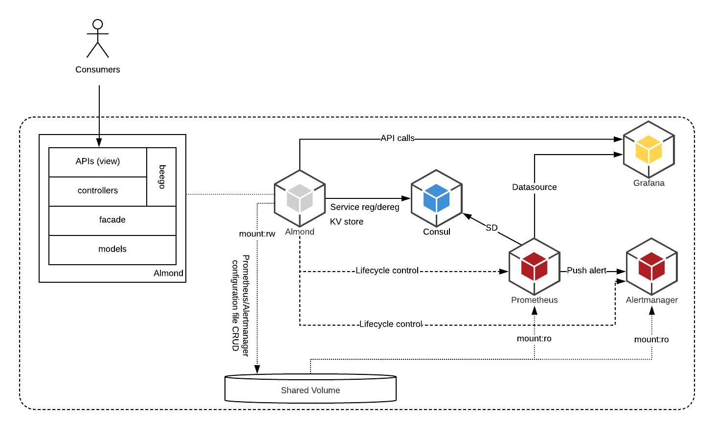

# almond

A simple glue solution for simplifying the configuration and use of the 
prometheus-alertmanager-grafana stack for service monitoring and alerting
in a multi-tenant environment.

almond is still under active development.

## 1. Architecture

### 1.1. Components

* Consul
  * Service registration for Prometheus to discover and scrape.
  * KV store for essential information.
* Prometheus
  * Where metrics are collected.
  * Where __alerting rules__ are defined.
* Prometheus Alertmanager
  * Where alerts are received and distributed.
* Grafana
  * Where metrics are exhibited.
* Almond
  * Providing deployment template to setup the stack easily.
  * Providing APIs to setup the rules and dashboards quickly.

### 1.2. Diagram 



## 2. Deployment

### 2.1. Use with docker
```
docker run -p 8080:8080 --name=almond joshuakwan/almond
```

### 2.2. Use with docker-compose

Use the compose file in the repo to launch the almond application along with dependent services
```
docker-compose up
```

## 3. Use almond, a typical happy flow

Redis is used in this example.

### Step 1. Launch almond

See [2. Deployment](##2.-Deployment)

### Step 2. Register grafana dashboards

See `resources/dashboards/` for the redis dashboard

```
POST /api/v1/almond/dashboards/redis HTTP/1.1
Host: almond_url

{
  "dashboard": {
     the_dashboard_body
   }
}
```

### Step 3. Setup the target service

Setup a redis service in anyway you like.

### Step 4. Setup the exporter to the target service

Download or build the [redis_exporter](https://github.com/oliver006/redis_exporter) and run it against the redis 
service

### Step 5. Register a new tenant

```
POST /api/v1/almond/tenants HTTP/1.1
Host: almond_url

{ 
		"name":"xman",
		"grafana_org": "xman-org",
		"grafana_org_user": "xman-admin",
		"grafana_org_user_password": "Passw0rd",
		"description":"yet another noisy tenant"
}
```

### Step 6. Register the redis service to almond under the new tenant

```
POST /api/v1/almond/xman/services HTTP/1.1
Host: almond_url

{ 
    	"id": "xman-redis",
    	"name": "redis",
    	"port": 9121,
    	"address": "1.2.3.4"
}
```

Now everything should be in place.
